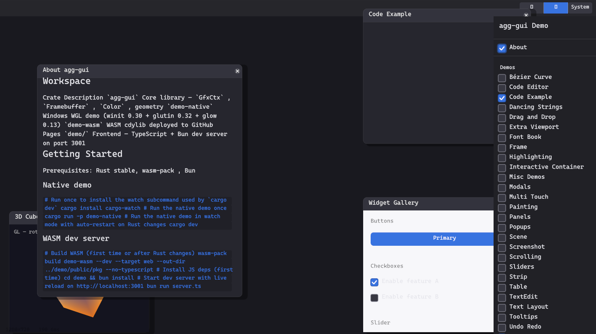

# agg-gui

`agg-gui` is an immediate-mode Rust GUI library built on
[Anti-Grain Geometry (AGG)](https://github.com/larsbrubaker/agg-rust).
It provides widgets, flex layout, text editing, markdown, SVG/image rendering,
theming, hit-tested input, and optional native/WASM adapter helpers while keeping
the rendering model simple: full redraw every frame, deterministic layout, and
Y-up coordinates throughout.

> Part of the [rust-apps](https://github.com/larsbrubaker/rust-apps) suite — a collection of Rust graphics and geometry libraries by Lars Brubaker.

[](https://crates.io/crates/agg-gui)
[](https://docs.rs/agg-gui)
[](https://github.com/larsbrubaker/agg-gui/actions/workflows/ci.yml)
[](https://larsbrubaker.github.io/agg-gui/)
[](https://buymeacoffee.com/larsbrubaker)

## Live Demo

> **[Open interactive WASM demo →](https://larsbrubaker.github.io/agg-gui/)**

[](https://larsbrubaker.github.io/agg-gui/)

## Install

The library crate is published to crates.io:

```sh
cargo add agg-gui
```

```toml
[dependencies]
agg-gui = "0.1"
# Optional: winit event-type adapters (for desktop hosts)
# agg-gui = { version = "0.1", features = ["winit-adapter", "clipboard"] }
```

Only the `agg-gui` library crate is published — the demo crates
(`demo-native`, `demo-wasm`, `demo-gl`, `demo-ui`) stay in-repo.

## Library

### Widgets And Layout

| Widget | Description |
|--------|-------------|
| `Label` | Static text, theme-aware color, left/center/right alignment |
| `Button` | Themeable background, focus ring, click callback |
| `CollapsingHeader` | Expand/collapse section with animated disclosure |
| `Checkbox` | Animated check mark, shared state cell for two-way binding |
| `ComboBox` | Popup-backed single-selection control |
| `ColorPicker` | Interactive color selection widget |
| `Slider` | Linear value control with focus ring and keyboard nudge |
| `DragValue` | Click-drag to increment/decrement numeric values |
| `RadioGroup` | Single-selection group with shared state |
| `ProgressBar` | Filled track with optional label |
| `ToggleSwitch` | Animated on/off toggle |
| `TextField` | Full text editing: cursor, selection, clipboard, undo/redo |
| `TextArea` | Multi-line text editing |
| `Hyperlink` | Underlined link text with click callback |
| `ImageView` | Image display widget |
| `ScrollView` | Vertical scroll with drag-thumb and mouse-wheel support |
| `Window` | Floating panel: draggable title bar, close button, resize handles, collapse |
| `FlexColumn` | Vertical flex layout with gap, padding, fixed + growing children |
| `FlexRow` | Horizontal flex layout |
| `Stack` | Z-ordered overlay layout (for floating windows) |
| `SizedBox` | Fixed-size constraint wrapper |
| `Splitter` | Draggable divider between two panes |
| `TabView` | Tabbed panel switcher |
| `TreeView` | Hierarchical list with expand/collapse and drag-and-drop |
| `Container` | Border + background decorator |
| `MarkdownView` | Markdown renderer: headings, paragraphs, lists, code blocks, images |
| `MenuBar` / `PopupMenu` / `Tooltip` | Menu and transient overlay primitives |
| `Separator` | Horizontal or vertical rule |
| `Spacer` / `Padding` | Layout utility widgets |

### Theme System

Dark, light, and system themes switchable at runtime via a three-button toggle in the top bar.
Every widget reads colors from `ctx.visuals()` — no hardcoded colors anywhere in the library.

```rust
// Switch to light mode programmatically
agg_gui::set_visuals(agg_gui::Visuals::light());
```

### Layout System

Flex layout with fixed and growing children, per-child margins, cross-axis anchoring
(left/center/right/stretch for columns; top/center/bottom/stretch for rows), min/max size
constraints, and inner padding.  A standalone `measure_text_metrics` function lets
`layout()` compute text-dependent sizes without requiring a `DrawCtx`.

### Event System

Y-up mouse events routed by hit-test through the widget tree with proper Z-order priority
(last child = topmost = first to receive events).  Capture semantics for drag operations.
Keyboard focus with Tab navigation and focus rings.  Undo/redo buffer for `TextField`.

### Drawing API

`DrawCtx` trait covers paths, fills, strokes, rounded rects, circles, arcs, Bézier curves,
text, transforms, clipping, compositing layers, image blitting, SVG rendering, and inline GL content.
Two implementations:

- **`GfxCtx`** — software AGG rasterizer writing to a `Framebuffer` (RGBA8, Y-up)
- **GL path** — tessellated via `tess2`, submitted as GPU draw calls; `GlPaint` trait for
  widgets that want to render their own 3-D content (e.g. the rotating cube demo)

### Platform Adapters

The core crate owns its event, cursor, clipboard, font, device-scale, screenshot,
and platform types. Optional adapters map winit input types into `agg-gui`, while
WASM builds include web keyboard/cursor and clipboard helpers.

### Inspector

Built-in widget inspector overlay (toggle via `show_inspector` cell): highlights the hovered
widget, shows the widget tree with bounds and properties, and reports hover position.

## Demo Shell

The demo shell is a faithful reimplementation of the [egui demo](https://www.egui.rs/) layout
and feature set using agg-gui's own widgets:

- **28 demo windows** — Bézier Curve, Code Editor, Code Example, Dancing Strings, Drag and
  Drop, Font Book, Frame, Highlighting, Interactive Container, Misc Demos, Modals,
  Multi Touch, Painting, Panels, Popups, Scene, Screenshot, Scrolling, Sliders, Strip,
  Table, TextEdit, Text Layout, Tooltips, Undo Redo, Widget Gallery, Window Options,
  and a 3D Cube GL showcase
- **11 test windows** — Clipboard, Cursor, Grid, Id, Input Event History, Input, Layout,
  Manual Layout, SVG, Tessellation, Window Resize
- **About window** — renders this README via `MarkdownView`, including images
- **Backend panel** — run mode (reactive/continuous), FPS graph, font selector, memory reset
- **Organize windows** — arranges all open windows into a tiled grid
- **Dark / Light / System** theme toggle in the top bar

## Workspace

| Crate | Description |
|-------|-------------|
| `agg-gui` | Core library — widgets, layout, drawing, theme, text, undo |
| `demo-ui` | Shared demo widget tree (identical for native and WASM) |
| `demo-native` | Windows/macOS/Linux WGL/WGL demo (winit 0.30 + glutin 0.32 + glow 0.13) |
| `demo-wasm` | WASM cdylib deployed to GitHub Pages |
| `demo/` | Frontend — TypeScript + Bun dev server on port 3001 |

## Getting Started

**Prerequisites:** Rust stable, [wasm-pack](https://rustwasm.github.io/wasm-pack/), [Bun](https://bun.sh/)

### Native demo

```sh
# Run once to install the watch subcommand
cargo install cargo-watch

# Run the native demo
cargo run -p demo-native

# Run with auto-restart on Rust changes
cargo dev
```

### WASM dev server

```sh
# Build WASM
wasm-pack build demo-wasm --dev --target web --out-dir ../demo/public/pkg --no-typescript

# Install JS deps (first time)
cd demo && bun install

# Start dev server on http://localhost:3001
bun run server.ts
```

### Run tests

```sh
cargo test -p agg-gui
```

## Design Principles

- **Y-up coordinates everywhere** — origin at bottom-left, positive Y upward. One conversion at event ingestion; no per-widget flipping.
- **Direct-to-GL rendering** — AGG paths rasterize directly to the GL surface. No retained scene graph, no layout cache to invalidate.
- **Full redraw every frame** — no dirty regions, no incremental update complexity.
- **Theme via thread-local** — `set_visuals()` writes to a thread-local read by every `DrawCtx::visuals()` call. Zero plumbing required in widget constructors.
- **Two-way state binding** — `Rc<Cell<T>>` shared between a sidebar checkbox and a floating window's visibility cell keeps UI in sync without callbacks.
- **No unsafe, no `RefCell` pervasion** — the widget tree is owned by `App`; mutable traversal uses index-based child access to satisfy the borrow checker cleanly.

## Development

Local path overrides for underlying libraries (uncomment in workspace `Cargo.toml`):

```toml
[patch.crates-io]
agg-rust       = { path = "../../agg-rust" }
clipper2-rust  = { path = "../../clipper2-rust" }
```

## License

MIT
